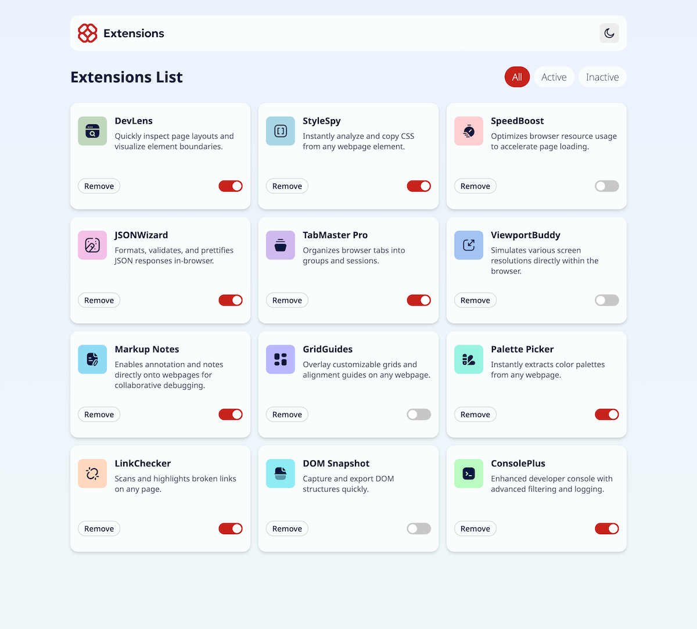

# Browsers Extensions Project
A simple project that displays browser extensions, showcasing my web development skills.

## Demo

## Usage
Open index.html in your browser to try it out.

## Features

- Responsive - adjusts layout based on screen width
- Theme - toggle between light and dark modes
- Activity toggle - Toggle extensions to make them active or inactive
- Filter - filter extensions based on active status

## Technologies
- HTML5
- CSS3
- Vanilla JavaScript

## Credits
I worked on this project alone, but I’d like to thank my friend Jing for being a constant support in my coding journey.